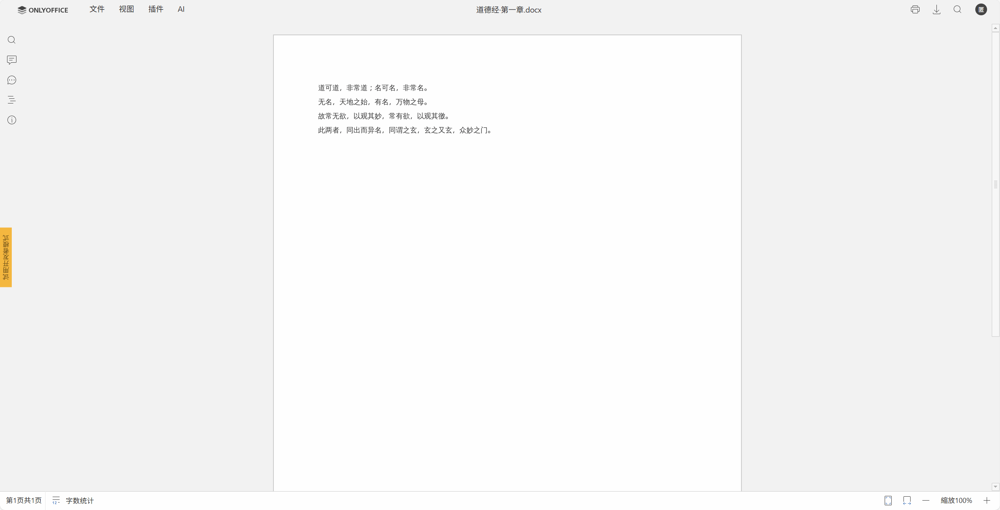

# File View

<div align="right">
  English | <a href="README.zh-CN.md">中文</a>
</div>

> A lightweight file preview starter component that supports online preview of various document and media formats, featuring a modular architecture that is easy to extend and customize.

[](https://jitpack.io/#com.gitee.wb04307201/file-view)
[](https://gitee.com/wb04307201/file-view)
[](https://gitee.com/wb04307201/file-view)
[](https://github.com/wb04307201/file-view)
[](https://github.com/wb04307201/file-view)  
  

---

## Supported File Types
- Office files (docx, xlsx, xls, pptx)
- Business Process Management files (bpmn, dmn, cmmn)
- Image files
- Video files
- Audio files
- Document files (pdf, ofd, epub)
- Text/Code files (sh, c, cpp, cs, css, diff, go, graphql, ini, java, js, json, kt, less, lua, mk, m, pl, php, phtml, txt, py, pyrepl, r, rb, rs, scss, sh, sql, swift, ts, vb, wasm, xml, yaml, yml)
- Markdown documents
- 3D model files (3dm, 3ds, 3mf, amf, bim, brep, dae, fbx, fcstd, gltf, ifc, iges, step, stl, obj, off, ply, wrl)
- Mind map files (xmind)
- Compressed files (zip)
- CAD (dwg, dxf)

## Integration

### Add JitPack Repository
```xml
<repositories>
    <repository>
        <id>jitpack.io</id>
        <url>https://jitpack.io</url>
    </repository>
</repositories>
```

### Maven Dependency
```xml
<dependency>
    <groupId>com.gitee.wb04307201.file-view</groupId>
    <artifactId>file-view-spring-boot-starter</artifactId>
    <version>1.3.1</version>
</dependency>
```

### Configuration
```yaml
file:
  view:
    ## The following are default processors, no configuration required by default
    bpmn:
        enable: true
    dmn:
        enable: true
    cmmn:
        enable: true
    code:
        enable: true
    epub:
        enable: true
    image:
        enable: true
    markdown:
        enable: true
    pdf:
        enable: true
    xmind:
        enable: true
    ofd:
        enable: true
    docx:
        enable: true
    excel:
        enable: true
    pptx:
        enable: true
    o3d:
        enable: true
    zip:
        enable: true
    cad:
        enable: true
    ## The following are default filename and processor matching rules, no configuration required by default
    strategies:
      - syntaxAndPattern: glob:*.bpmn
        serviceName: bpmn
      - syntaxAndPattern: glob:*.dmn
        serviceName: dmn
      - syntaxAndPattern: glob:*.cmmn
        serviceName: cmmn
      - syntaxAndPattern: glob:*.{sh,c,cpp,cs,css,diff,go,graphql,ini,java,js,json,kt,less,lua,mk,m,pl,php,phtml,html,txt,py,pyrepl,r,rb,rs,scss,sh,sql,swift,ts,vb,wasm,xml,yaml,yml}
        serviceName: code
      - syntaxAndPattern: glob:*.epub
        serviceName: epub
      - syntaxAndPattern: glob:*.{jpg,png,bmp,gif,tiff,webp,svg,raw,heic,cr2,nef,orf,sr2}
        serviceName: image
      - syntaxAndPattern: glob:*.md
        serviceName: markdown
      - syntaxAndPattern: glob:*.pdf
        serviceName: pdf
      - syntaxAndPattern: glob:*.xmind
        serviceName: xmind
      - syntaxAndPattern: glob:*.ofd
        serviceName: ofd
      - syntaxAndPattern: glob:*.docx
        serviceName: docx
      - syntaxAndPattern: glob:*.{xlsx,xls}
        serviceName: excel
      - syntaxAndPattern: glob:*.pptx
        serviceName: pptx
      - syntaxAndPattern: glob:*.{3dm,3ds,3mf,amf,bim,brep,dae,fbx,fcstd,gltf,ifc,iges,step,stl,obj,off,ply,wrl}
        serviceName: o3d
      - syntaxAndPattern: glob:*.zip
        serviceName: zip
      - syntaxAndPattern: glob:*.{dwg,dxf}
        serviceName: cad
```

`syntaxAndPattern` matches filenames by specifying a syntax (such as glob or regex):
- glob: `*.txt`
- regex: `(.*)\.txt`

## Usage

### Static Resource Library
Some file types use built-in renderers, such as: pdf, epub, xmind, zip, image, code, markdown, cmmn, dmn, bpmn, etc.
The JS library resources are loaded from jsDelivr. If you cannot get resources from jsDelivr, you can add `file-view-static` to localize the JS libraries.
```xml
<dependency>
    <groupId>com.gitee.wb04307201.file-view</groupId>
    <artifactId>file-view-static</artifactId>
    <version>1.3.1</version>
</dependency>
```

### Access Built-in Interface for File Upload and Preview
Visit `http://localhost:8080/file/view`  
  


### Preview Extension
The following uses OnlyOffice as an example to illustrate how to extend previews:
1. Install [OnlyOffice Document Server Developer Edition](https://api.onlyoffice.com/docs/docs-api/get-started/basic-concepts/) using docker
```bash
docker run --name onlyoffice -i -t -d -p 80:80 -e JWT_ENABLED=false -e ALLOW_PRIVATE_IP_ADDRESS=true onlyoffice/documentserver-de
```

2. File preview renderer extension  
Write an implementation of the `IView.java` interface `OnlyOfficeView.java`:
```java
package cn.wubo.file.view.test;

import cn.wubo.file.view.preview.IView;
import org.springframework.stereotype.Service;
import org.springframework.web.servlet.function.ServerRequest;
import org.springframework.web.servlet.function.ServerResponse;

import java.net.URI;

@Service
public class OnlyOfficeView implements IView {
    @Override
    public String getServiceName() {
        return "onlyoffice";
    }

    @Override
    public ServerResponse handle(ServerRequest request) {
        String id = request.pathVariable("id");
        return ServerResponse.temporaryRedirect(URI.create(String.format("/onlyoffice.html?id=%s",id))).build();
    }
}
```

Create page `onlyoffice.html`:
```html
<!DOCTYPE html>
<html lang="zh-cmn-Hans">
<head>
    <meta charset="UTF-8">
    <meta name="viewport" content="width=device-width, initial-scale=1.0">
    <script src="/static/common.js"></script>
    <script type="text/javascript" src="http://localhost/web-apps/apps/api/documents/api.js"></script>
    <title>onlyoffice</title>
    <style>
        html, body {
            height: 100%;
            padding: 0;
            margin: 0;
        }
    </style>
</head>
<body>
<div id="placeholder"></div>
<script>
    document.addEventListener('DOMContentLoaded', function () {
        const id = getUrlParam('id');

        fetch(`/wopi/files/${id}`)
            .then(response => response.json())
            .then(data => {
                const fileName = data.BaseFileName;
                const fileType = data.BaseFileName.substring(data.BaseFileName.lastIndexOf('.') + 1);
                let documentType;
                if (fileType === 'docx' || fileType === 'doc') documentType = 'word';
                if (fileType === 'xlsx' || fileType === 'xls') documentType = 'cell';
                if (fileType === 'pptx' || fileType === 'ppt') documentType = 'slide';

                const config = {
                    "type": "desktop",
                    "width": "100%",
                    "height": "100%",
                    "documentType": `${documentType}`,
                    "document": {
                        "fileType": `${fileType}`,
                        "key": `${data.id}`,
                        "title": `${fileName}`,
                        "url": `http://192.168.31.197:8080/wopi/files/${data.id}/contents`,
                    },
                    "editorConfig": {
                        "mode": "view",
                        "lang": "zh"
                    },
                };

                console.log('config',config)

                const docEditor = new DocsAPI.DocEditor("placeholder", config);
            });
    });
</script>
</body>
</html>
```

3. Modify configuration, disable duplicate renderers, redefine file matching rules `application.yml`:
```yaml
file:
  view:
    docx:
        enable: false
    excel:
        enable: false
    pptx:
        enable: false
    strategies:
      - syntaxAndPattern: glob:*.{docx,doc,xlsx,xls,pptx,ppt}
        serviceName: onlyoffice
```

Preview effect:  


### File Storage Extension
The following uses MinIO as an example to illustrate how to extend file storage:
1. Install MinIO using docker:
```bash
docker run -p 9000:9000 -p 9001:9001 --name minio -e "MINIO_ROOT_USER=ROOTUSER" -e "MINIO_ROOT_PASSWORD=CHANGEME123" quay.io/minio/minio server /data --console-address ":9001"
```

2. Add MinIO dependency:
```xml
<dependency>
    <groupId>io.minio</groupId>
    <artifactId>minio</artifactId>
    <version>8.6.0</version>
</dependency>
```

3. Write an implementation of the `IFileStorage.java` interface `MinioFileStorageImpl.java`:
```java
package cn.wubo.file.view.test;

import cn.wubo.file.view.exception.LocalFileStorageException;
import cn.wubo.file.view.storage.IFileStorage;
import cn.wubo.file.view.storage.dto.FileStorageInfo;
import cn.wubo.file.view.utils.VersionUtls;
import io.minio.GetObjectArgs;
import io.minio.MinioClient;
import io.minio.PutObjectArgs;
import io.minio.RemoveObjectArgs;
import org.springframework.stereotype.Service;

import java.io.ByteArrayInputStream;
import java.io.IOException;
import java.io.InputStream;
import java.nio.file.Path;
import java.nio.file.Paths;
import java.security.InvalidKeyException;
import java.security.NoSuchAlgorithmException;
import java.util.ArrayList;
import java.util.List;
import java.util.UUID;

@Service
public class MinioFileStorageImpl implements IFileStorage {

    private final MinioClient minioClient;

    private static final String BUCKET_NAME = "temp";

    private static List<FileStorageInfo> fileStorageInfos = new ArrayList<>();

    public MinioFileStorageImpl() {
        this.minioClient = new MinioClient.Builder()
                .endpoint("http://127.0.0.1:9000")
                .credentials("ROOTUSER", "12345678")
                .build();
    }

    @Override
    public FileStorageInfo upload(String fileName, byte[] content, String mimeType) {
        try {
            String id = UUID.randomUUID().toString();
            String version = VersionUtls.generateContentVersion(content, id);
            Path filePath = Paths.get(version, fileName);

            minioClient.putObject(
                    PutObjectArgs.builder()
                            .bucket(BUCKET_NAME)
                            .object(filePath.toString())
                            .stream(new ByteArrayInputStream(content), content.length, -1)
                            .contentType(mimeType)
                            .build()
            );

            FileStorageInfo fpi = new FileStorageInfo(id, fileName, content.length, mimeType, filePath.toString(), version);
            fileStorageInfos.add(fpi);
            return fpi;
        } catch (NoSuchAlgorithmException | IOException | InvalidKeyException | InvalidResponseException | InsufficientDataException | InternalException | ErrorResponseException | XmlParserException | ServerException e) {
            throw new LocalFileStorageException(e.getMessage(), e);
        }
    }

    @Override
    public FileStorageInfo findById(String id) {
        return fileStorageInfos.stream()
                .filter(fpi -> fpi.getId().equals(id))
                .findAny()
                .orElseThrow(() -> new LocalFileStorageException("File info not found for id: " + id));
    }

    @Override
    public List<FileStorageInfo> list() {
        return fileStorageInfos;
    }

    @Override
    public byte[] getContentByLocation(String location) {
        try {
            InputStream is = minioClient.getObject(
                    GetObjectArgs.builder()
                            .bucket(BUCKET_NAME)
                            .object(location)
                            .build()
            );
            return is.readAllBytes();
        } catch (IOException | InvalidKeyException | InvalidResponseException | NoSuchAlgorithmException |
                 InsufficientDataException | InternalException | ErrorResponseException | XmlParserException | ServerException e) {
            throw new LocalFileStorageException(e.getMessage(), e);
        }
    }

    @Override
    public Boolean deleteById(String id) {
        FileStorageInfo fsi = findById(id);
        if (fsi != null) {
            try {
                minioClient.removeObject(
                        RemoveObjectArgs.builder()
                                .bucket(BUCKET_NAME)
                                .object(fsi.getLocation())
                                .build()
                );
                fileStorageInfos.remove(fsi);
            } catch (IOException | InvalidKeyException | InvalidResponseException | NoSuchAlgorithmException |
                     InsufficientDataException | InternalException | ErrorResponseException | XmlParserException | ServerException e) {
                throw new LocalFileStorageException(e.getMessage(), e);
            }
        }
        return true;
    }
}
```

## Third-party Libraries Used

| File Type | Third-party Library |
|-----------|---------------------|
| Office files | [vue-office](https://github.com/501351981/vue-office) |
| Business Process Management files | [bpmn-io](https://github.com/bpmn-io) |
| Image files | [viewerjs](https://github.com/fengyuanchen/viewerjs) |
| Document files (pdf) | [pdfobject](https://github.com/pipwerks/PDFObject) |
| Document files (ofd) | [ofd.js](https://github.com/DLTech21/ofd.js) |
| Document files (epub) | [epub.js](https://github.com/futurepress/epub.js) |
| Text/Code files | [highlight.js](https://github.com/highlightjs/highlight.js) |
| Markdown documents | [vditor](https://github.com/Vanessa219/vditor) |
| 3D model files | [Online3DViewer](https://github.com/kovacsv/Online3DViewer) |
| Mind map files | [xmind-embed-viewer](https://github.com/xmindltd/xmind-embed-viewer) |
| Compressed files | [jszip](https://github.com/Stuk/jszip) |
| CAD | [CAD-Viewer](https://github.com/mlightcad/cad-viewer) |