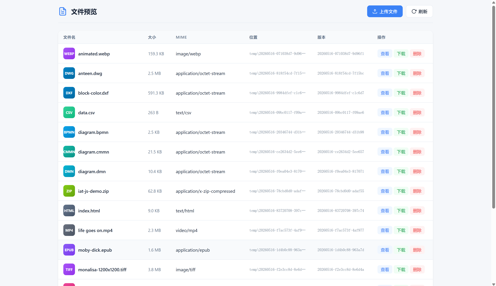
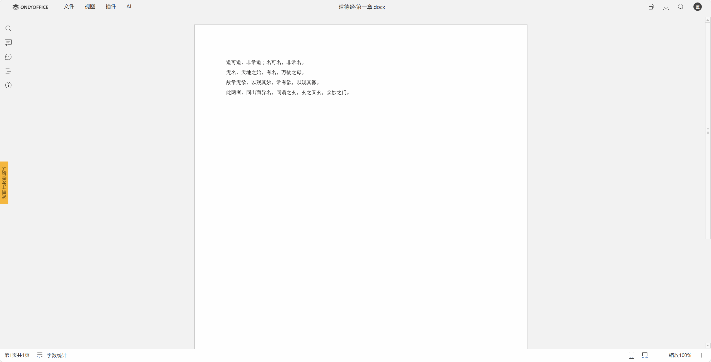

# File View 文件预览

<div align="right">
  <a href="README.md">English</a> | 中文
</div>

> 一个 Spring Boot 的轻量级文件在线预览 Starter 组件，通过简单的 Maven 依赖引入即可为项目提供 docx/xlsx/pptx/PDF/BPMN/图片/视频/代码/3D 模型/CAD 等 20+ 种文件格式的在线预览能力。


[](https://gitee.com/wb04307201/file-view)
[](https://gitee.com/wb04307201/file-view)
[](https://github.com/wb04307201/file-view)
[](https://github.com/wb04307201/file-view)  
  

---

## 版本说明

> **1.4.0 及更高版本**：基于 JDK 25 + Spring Boot 4.x（当前分支）
> **1.4.0-sb3**：基于 JDK 17 + Spring Boot 3.x

### Maven 依赖

#### JDK 25 + Spring Boot 4.x（推荐）
```xml
<dependency>
    <groupId>io.github.wb04307201</groupId>
    <artifactId>file-view-spring-boot-starter</artifactId>
    <version>1.4.0</version>
</dependency>
```

#### JDK 17 + Spring Boot 3.x
```xml
<dependency>
    <groupId>io.github.wb04307201</groupId>
    <artifactId>file-view-spring-boot-starter</artifactId>
    <version>1.4.0-sb3</version>
</dependency>
```

---

## 支持的文件类型
- office文件(docx,xlsx,pptx)
- 业务流程管理文件(bpmn,dmn,cmmn)
- 图片文件
- 视频文件
- 音频文件
- 文档文件(pdf,epub,ofd)
- TIFF图像文件
- 文本文件/代码文件(c, cpp, cs, css, diff, go, graphql, html, ini, java, js, json, kt, less, lua, m, mk, pl, php, phtml, py, pyrepl, r, rb, rs, scss, sh, sql, swift, ts, vb, wasm, xml, yaml, yml)
- Markdown文档文件
- 3D模型文件(3dm,3ds,3mf,amf,bim,brep,dae,fbx,fcstd,gltf,ifc,iges,step,stl,obj,off,ply,wrl)
- 思维导图文件(xmind)
- 压缩文件(zip)
- CAD(dwg,dxf)

## 引入

### 添加Maven依赖
```xml
<dependency>
    <groupId>io.github.wb04307201</groupId>
    <artifactId>file-view-spring-boot-starter</artifactId>
    <version>1.0.0</version>
</dependency>
```

### 配置文件
```yaml
file:
  view:
    ## 以下为默认的处理器,默认无需配置
    bpmn:
      enable: true
    dmn:
      enable: true
    cmmn:
      enable: true
    code:
      enable: true
    epub:
      enable: true
    image:
      enable: true
    markdown:
      enable: true
    pdf:
      enable: true
    xmind:
      enable: true
    docx:
      enable: true
    excel:
      enable: true
    pptx:
      enable: true
    o3d:
      enable: true
    zip:
      enable: true
    cad:
      enable: true
    csv:
      enable: true
    tiff:
      enable: true
    ofd:
      enable: true
    ## 以下为默认的文件名和处理器匹配规则,默认无需配置
    strategies:
      - syntaxAndPattern: glob:*.bpmn
        serviceName: bpmn
      - syntaxAndPattern: glob:*.dmn
        serviceName: dmn
      - syntaxAndPattern: glob:*.cmmn
        serviceName: cmmn
      - syntaxAndPattern: glob:*.{c,cpp,cs,css,diff,go,graphql,html,ini,java,js,json,kt,less,lua,m,mk,pl,php,phtml,py,pyrepl,r,rb,rs,scss,sh,sql,swift,ts,vb,wasm,xml,yaml,yml}
        serviceName: code
      - syntaxAndPattern: glob:*.epub
        serviceName: epub
      - syntaxAndPattern: glob:*.{jpg,png,bmp,gif,webp,svg,raw,heic,cr2,nef,orf,sr2}
        serviceName: image
      - syntaxAndPattern: glob:*.md
        serviceName: markdown
      - syntaxAndPattern: glob:*.pdf
        serviceName: pdf
      - syntaxAndPattern: glob:*.xmind
        serviceName: xmind
      - syntaxAndPattern: glob:*.docx
        serviceName: docx
      - syntaxAndPattern: glob:*.{xlsx,xls}
        serviceName: excel
      - syntaxAndPattern: glob:*.pptx
        serviceName: pptx
      - syntaxAndPattern: glob:*.{3dm,3ds,3mf,amf,bim,brep,dae,fbx,fcstd,gltf,ifc,iges,step,stl,obj,off,ply,wrl}
        serviceName: o3d
      - syntaxAndPattern: glob:*.zip
        serviceName: zip
      - syntaxAndPattern: glob:*.csv
        serviceName: csv
      - syntaxAndPattern: glob:*.{tif,tiff}
        serviceName: tiff
      - syntaxAndPattern: glob:*.ofd
        serviceName: ofd
      - syntaxAndPattern: glob:*.{dwg,dxf}
        serviceName: cad
```

`syntaxAndPattern`通过指定语法（如 glob 或 regex）对文件名进行匹配：
- glob：`*.txt`
- regex：`(.*)\.txt`

## 使用

### 静态资源库
部分文件类型使用内置渲染器，如：pdf、epub、xmind、zip、image、code、markdown、cmmn、dmn、bpmn等
使用的js库资源从jsDelivr加载，如无法从jsDelivr获取资源，可以添加`file-view-static`将js库本地化
```xml
<dependency>
    <groupId>io.github.wb04307201</groupId>
    <artifactId>file-view-static</artifactId>
    <version>1.0.0</version>
</dependency>
```

### 访问内置界面进行文件上传和预览
访问 `http://localhost:8080/file/view`  
  

> 所有预览页面右上角均内置悬浮下载按钮，鼠标靠近时淡入显示，点击即可下载原始文件。

### REST API

| 方法 | 路径 | 说明 |
|------|------|------|
| POST | `/file/view/upload` | 上传文件（支持多文件上传，返回 `List<FileStorageInfo>` 数组） |
| GET | `/file/view/list` | 获取已上传的文件列表 |
| GET | `/file/view/{id}` | 预览指定 ID 的文件 |
| POST | `/file/view/deleteById` | 删除指定 ID 的文件（请求体 JSON：`{"id": "文件ID"}`） |
| GET | `/wopi/files/{id}` | WOPI 接口：获取文件元信息 |
| GET | `/wopi/files/{id}/contents` | WOPI 接口：获取文件内容 |

### 预览扩展
下面以OnlyOffice为例说明如何扩展预览：
1. 使用docker安装[OnlyOffice文档开发者版](https://api.onlyoffice.com/docs/docs-api/get-started/basic-concepts/)
```bash
docker run --name onlyoffice -i -t -d -p 80:80 -e JWT_ENABLED=false -e ALLOW_PRIVATE_IP_ADDRESS=true onlyoffice/documentserver-de
```

2. 文件预览渲染器扩展  
编写`IView.java`接口的实现`OnlyOfficeView.java`：
```java
package cn.wubo.file.view.test;

import cn.wubo.file.view.preview.IView;
import org.springframework.stereotype.Service;
import org.springframework.web.servlet.function.ServerRequest;
import org.springframework.web.servlet.function.ServerResponse;

import java.net.URI;

@Service
public class OnlyOfficeView implements IView {
    @Override
    public String getServiceName() {
        return "onlyoffice";
    }

    @Override
    public ServerResponse handle(ServerRequest request) {
        String id = request.pathVariable("id");
        return ServerResponse.temporaryRedirect(URI.create(String.format("/onlyoffice.html?id=%s",id))).build();
    }
}
```

编写页面`onlyoffice.html`：
```html
<!DOCTYPE html>
<html lang="zh-cmn-Hans">
<head>
    <meta charset="UTF-8">
    <meta name="viewport" content="width=device-width, initial-scale=1.0">
    <script src="/static/common.js"></script>
    <script type="text/javascript" src="http://localhost/web-apps/apps/api/documents/api.js"></script>
    <title>onlyoffice</title>
    <style>
        html, body {
            height: 100%;
            padding: 0;
            margin: 0;
        }
    </style>
</head>
<body>
<div id="placeholder"></div>
<script>
    document.addEventListener('DOMContentLoaded', function () {
        const id = getUrlParam('id');

        fetch(`/wopi/files/${id}`)
            .then(response => response.json())
            .then(data => {
                const fileName = data.BaseFileName;
                const fileType = data.BaseFileName.substring(data.BaseFileName.lastIndexOf('.') + 1);
                let documentType;
                if (fileType === 'docx' || fileType === 'doc') documentType = 'word';
                if (fileType === 'xlsx' || fileType === 'xls') documentType = 'cell';
                if (fileType === 'pptx' || fileType === 'ppt') documentType = 'slide';

                const config = {
                    "type": "desktop",
                    "width": "100%",
                    "height": "100%",
                    "documentType": `${documentType}`,
                    "document": {
                        "fileType": `${fileType}`,
                        "key": `${data.id}`,
                        "title": `${fileName}`,
                        "url": `${window.location.origin}/wopi/files/${data.id}/contents`,
                    },
                    "editorConfig": {
                        "mode": "view",
                        "lang": "zh"
                    },
                };

                console.log('config',config)

                const docEditor = new DocsAPI.DocEditor("placeholder", config);
            });
    });
</script>
</body>
</html>
```

3. 修改配置，关闭重复的渲染器，重定义文件匹配规则`application.yml`：
```yaml
file:
  view:
    docx:
      enable: false
    excel:
      enable: false
    pptx:
      enable: false
    strategies:
      - ...
    #      - syntaxAndPattern: glob:*.docx
    #        serviceName: docx
    #      - syntaxAndPattern: glob:*.xlsx
    #        serviceName: excel
    #      - syntaxAndPattern: glob:*.pptx
    #        serviceName: pptx
      - syntaxAndPattern: glob:*.{docx,doc,xlsx,xls,pptx,ppt}
        serviceName: onlyoffice
```

预览效果如下：  


### 文件存储扩展
下面以MinIO为例说明如何扩展文件存储：
1. 使用docker安装MinIO：
```bash
docker run -p 9000:9000 -p 9001:9001 --name minio -e "MINIO_ROOT_USER=ROOTUSER" -e "MINIO_ROOT_PASSWORD=CHANGEME123" quay.io/minio/minio server /data --console-address ":9001"
```

2. 添加MinIO依赖：
```xml
<dependency>
    <groupId>io.minio</groupId>
    <artifactId>minio</artifactId>
    <version>8.6.0</version>
</dependency>
```

3. 编写接口`IFileStorage.java`的实现`MinioFileStorageImpl.java`：
```java
package cn.wubo.file.view.test;

import cn.wubo.file.view.exception.LocalFileStorageException;
import cn.wubo.file.view.storage.IFileStorage;
import cn.wubo.file.view.storage.dto.FileStorageInfo;
import cn.wubo.file.view.utils.VersionUtls;
import io.minio.GetObjectArgs;
import io.minio.MinioClient;
import io.minio.PutObjectArgs;
import io.minio.RemoveObjectArgs;
import org.springframework.stereotype.Service;

import java.io.ByteArrayInputStream;
import java.io.IOException;
import java.io.InputStream;
import java.nio.file.Path;
import java.nio.file.Paths;
import java.security.InvalidKeyException;
import java.security.NoSuchAlgorithmException;
import java.util.ArrayList;
import java.util.List;
import java.util.UUID;

@Service
public class MinioFileStorageImpl implements IFileStorage {

    private final MinioClient minioClient;

    private static final String BUCKET_NAME = "temp";

    private static List<FileStorageInfo> fileStorageInfos = new ArrayList<>();

    public MinioFileStorageImpl() {
        this.minioClient = new MinioClient.Builder()
                .endpoint("http://127.0.0.1:9000")
                .credentials("ROOTUSER", "CHANGEME123")
                .build();
    }

    @Override
    public FileStorageInfo upload(String fileName, byte[] content, String mimeType) {
        try {
            String id = UUID.randomUUID().toString();
            String version = VersionUtls.generateContentVersion(content, id);
            Path filePath = Paths.get(version, fileName);

            minioClient.putObject(
                    PutObjectArgs.builder()
                            .bucket(BUCKET_NAME)
                            .object(filePath.toString())
                            .stream(new ByteArrayInputStream(content), content.length, -1)
                            .contentType(mimeType)
                            .build()
            );

            FileStorageInfo fpi = new FileStorageInfo(id, fileName, content.length, mimeType, filePath.toString(), version);
            fileStorageInfos.add(fpi);
            return fpi;
        } catch (NoSuchAlgorithmException | IOException | InvalidKeyException | InvalidResponseException | InsufficientDataException | InternalException | ErrorResponseException | XmlParserException | ServerException e) {
            throw new LocalFileStorageException(e.getMessage(), e);
        }
    }

    @Override
    public FileStorageInfo findById(String id) {
        return fileStorageInfos.stream()
                .filter(fpi -> fpi.getId().equals(id))
                .findAny()
                .orElseThrow(() -> new LocalFileStorageException("File info not found for id: " + id));
    }

    @Override
    public List<FileStorageInfo> list() {
        return fileStorageInfos;
    }

    @Override
    public byte[] getContentByLocation(String location) {
        try {
            InputStream is = minioClient.getObject(
                    GetObjectArgs.builder()
                            .bucket(BUCKET_NAME)
                            .object(location)
                            .build()
            );
            return is.readAllBytes();
        } catch (IOException | InvalidKeyException | InvalidResponseException | NoSuchAlgorithmException |
                 InsufficientDataException | InternalException | ErrorResponseException | XmlParserException | ServerException e) {
            throw new LocalFileStorageException(e.getMessage(), e);
        }
    }

    @Override
    public Boolean deleteById(String id) {
        FileStorageInfo fsi = findById(id);
        if (fsi != null) {
            try {
                minioClient.removeObject(
                        RemoveObjectArgs.builder()
                                .bucket(BUCKET_NAME)
                                .object(fsi.getLocation())
                                .build()
                );
                fileStorageInfos.remove(fsi);
            } catch (IOException | InvalidKeyException | InvalidResponseException | NoSuchAlgorithmException |
                     InsufficientDataException | InternalException | ErrorResponseException | XmlParserException | ServerException e) {
                throw new LocalFileStorageException(e.getMessage(), e);
            }
        }
        return true;
    }
}
```

## 使用的第三方库

| 文件类型 | 第三方库 |
|----------|----------|
| DOCX 文件 | [docx-preview](https://github.com/VolodymyrBaydak/docx-preview) + [JSZip](https://github.com/Stuk/jszip) |
| XLSX 文件 | [SheetJS](https://github.com/SheetJS/sheetjs) |
| PPTX 文件 | [pptxviewjs](https://github.com/nicktomach/pptxviewjs) + [Chart.js](https://github.com/chartjs/Chart.js) |
| 业务流程管理文件 | [bpmn-js](https://github.com/bpmn-io/bpmn-js) / [cmmn-js](https://github.com/bpmn-io/cmmn-js) / [dmn-js](https://github.com/bpmn-io/dmn-js) |
| 图片文件 | [Viewer.js](https://github.com/fengyuanchen/viewerjs) |
| 文档文件(PDF) | [PDFObject](https://github.com/pipwerks/PDFObject) |
| 文档文件(EPUB) | [epub.js](https://github.com/futurepress/epub.js) + [JSZip](https://github.com/Stuk/jszip) |
| 文本文件/代码文件 | [highlight.js](https://github.com/highlightjs/highlight.js) |
| Markdown文档文件 | [Vditor](https://github.com/Vanessa219/vditor) |
| CSV 文件 | [Papa Parse](https://github.com/mholt/PapaParse) |
| 3D 模型文件 | [Online 3D Viewer](https://github.com/kovacsv/Online3DViewer) + [Three.js](https://github.com/mrdoob/three.js) |
| 思维导图文件 | [xmind-embed-viewer](https://github.com/xmindltd/xmind-embed-viewer) |
| 压缩文件 | [JSZip](https://github.com/Stuk/jszip) |
| CAD 文件(DWG/DXF) | [@mlightcad/cad-simple-viewer](https://github.com/mlightcad/cad-viewer) + [Three.js](https://github.com/mrdoob/three.js) |
| TIFF 图像文件 | [UTIF.js](https://github.com/photopea/UTIF.js) + [pako](https://github.com/nodeca/pako) |
| OFD 文件 | [xq-doc-viewer](https://www.npmjs.com/package/xq-doc-viewer) |